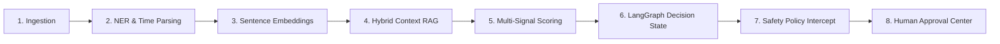

# AI & Agentic Processing Pipeline: MailMind (InboxGuard)

## 1. Overview

The AI engine in InboxGuard does not act as a simple chatbot or naive classifier. It implements an **Agentic Decision Support System** orchestrated with **LangGraph**, where email content is treated as untrusted input.

---

## 2. Information Extraction (NER & Temporal Parsing)

- **Named Entity Recognition**: Lexical analysis extracting `PERSON` (salutations and signatures), `ORG` (employers, universities), `MONEY` (salaries, checks, fees), `URL` (application portals, meetings), and `DEADLINE`.
- **Temporal Parser**: Normalizes relative date phrases ("by this Friday 5 PM", "tomorrow", "next Monday") into UTC timestamps based on reference email arrival times.

---

## 3. LangGraph Orchestrator

The system models decision reasoning as a typed state graph with nodes:
1. `understand_email_node`: Extracts category, intent, tasks, and initial risk.
2. `retrieve_context_node`: Queries the Hybrid RAG engine to incorporate historical thread context.
3. `storage_analysis_node`: Evaluates payload storage impact, redundancy, and waste score.
4. `task_commitment_node`: Validates tasks and checks commitment FSM state.
5. `job_analysis_node`: Evaluates recruitment authenticity and candidate match.
6. `decision_agent_node`: Synthesizes confidence and recommended action (`KEEP`, `ARCHIVE`, `DELETE`, `REMIND`, `SCHEDULE`, `PREPARE_APPLICATION`).
7. `safety_policy_node`: Evaluates risk tier (`LOW`, `MEDIUM`, `HIGH`) and routes destructive or external actions to the Human-in-the-Loop approval queue.

---

## 4. LLM Provider Abstraction

An `LLMProvider` abstraction isolates model selection from business logic, supporting:
- **Google Gemini** (`gemini-1.5-flash` via `google-generativeai`)
- **OpenAI / OpenAI-compatible endpoints**
- **Local Ollama** (e.g. `llama3`, `mistral`)
- **Heuristic Deterministic NLP Engine** (ensuring 100% offline, zero-cost unit testing and viva defense)
