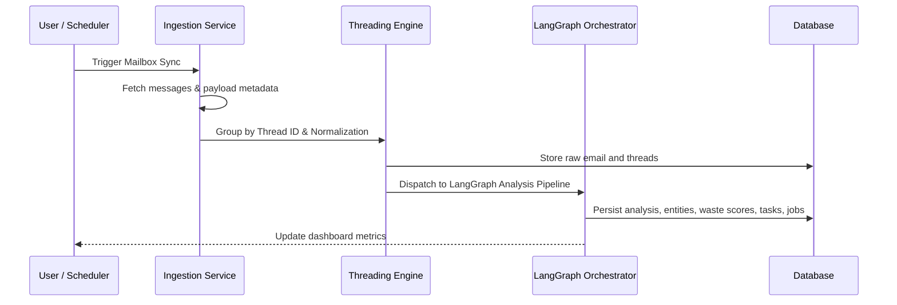
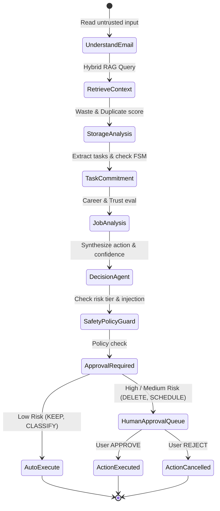

# System Architecture: MailMind (InboxGuard)

**Academic Project Title**: MailMind: Agentic AI for Smart Email and Career Intelligence  
**Application / Product Name**: InboxGuard  

---

## 1. High-Level System Architecture

InboxGuard implements a decoupled, event-driven decision-support architecture where email content is treated as untrusted input. The system executes a multi-signal analytical pipeline orchestrating Storage Intelligence, Task/Commitment tracking, Career matching, and human-in-the-loop authorization.

```mermaid
flowchart TD
    User([User / Browser]) <--> UI[React + Vite + Tailwind Frontend]
    UI <--> API[FastAPI REST API Layer]

    subgraph Backend Core
        API --> Auth[Authentication & OAuth Service]
        API --> Ingestion[Email Ingestion & Threading Engine]
        API --> LangGraph[LangGraph Agentic Orchestrator]
        API --> Safety[Safety & Policy Guard]
        API --> Execution[Action Execution Service]
    end

    subgraph Intelligence & Scoring Layer
        LangGraph --> NLP[NLP & Entity Extractor (NER + Time)]
        LangGraph --> Embed[Embedding Service (all-MiniLM-L6-v2)]
        LangGraph --> RAG[Hybrid RAG Engine (Vector + BM25 RRF)]
        LangGraph --> StorageScorer[Storage Waste Scorer]
        LangGraph --> TaskEngine[Task & Commitment FSM Engine]
        LangGraph --> JobEngine[Job Matcher & Recruiter Trust Scorer]
    end

    subgraph Storage & Persistence
        API <--> DB[(PostgreSQL + pgvector / SQLite Dual-Engine)]
        DB --> UsersTable[users & oauth_accounts]
        DB --> EmailsTable[emails, threads & embeddings]
        DB --> TasksTable[tasks & commitments]
        DB --> JobsTable[jobs, resumes & matches]
        DB --> ActionsTable[approvals & audit_logs]
    end

    subgraph External Integrations
        Ingestion <--> GmailAPI[Gmail API (v1)]
        Execution --> GmailAPI
        Execution --> CalAPI[Google Calendar API (v3)]
    end
```

---

## 2. Ingestion & Threading Data Flow



---

## 3. LangGraph Decision Graph Flow


