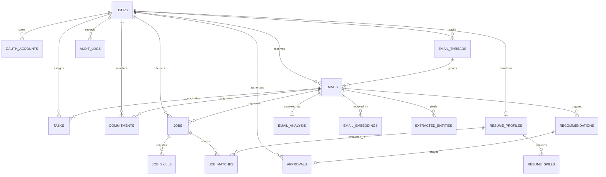

# Database Architecture & ER Diagram: MailMind (InboxGuard)

## 1. Entity-Relationship Diagram

## 2. Table Specifications

### `users`
- `id` (UUID): Primary key.
- `email` (VARCHAR 255): Unique user email address.
- `full_name` (VARCHAR 255): User display name.
- `is_demo` (BOOLEAN): Flag indicating whether user is executing in demo mode.
- `preferences` (JSON): Stored user theme, thresholds, and notifications.

### `emails` & `email_threads`
- Stores external message IDs, RFC headers, sender, recipient arrays, parsed plain text and HTML bodies, payload sizes, attachments metadata, and processing state (`UNPROCESSED`, `PROCESSING`, `PROCESSED`, `FAILED`).

### `email_analysis`
- Contains multidimensional decision features:
  - `category`: Extracted class (Education, Meeting, Promotion, Job Opportunity, Finance, Security).
  - `importance` (0.0 to 1.0): Urgency and sender importance weight.
  - `storage_waste_score` (0.0 to 100.0): Computed penalty decision score.
  - `security_risk_level`: `LOW`, `MEDIUM`, `HIGH`.
  - `raw_analysis` (JSON): Itemized penalty contributions.

### `email_embeddings`
- Stores 384-dimensional dense vectors generated by `all-MiniLM-L6-v2`. Portable across PostgreSQL `pgvector` and SQLite.

### `tasks` & `commitments`
- `tasks`: Explicit to-do items with deadlines, priorities, and confidence scores.
- `commitments`: Finite State Machine (`OPEN`, `PROMISED`, `COMPLETED`, `OVERDUE`, `CANCELLED`) tracking conversational promises made by the user or senders.

### `jobs`, `resumes`, and `job_matches`
- Normalized skills, required vs preferred requirements, education tiers, trust risk scores, and mathematical match percentages.
