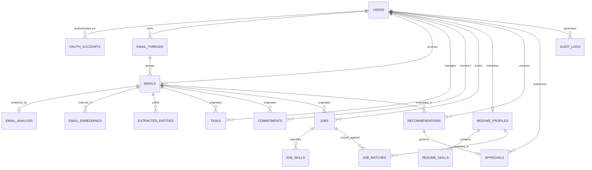

# Database Architecture & Schema Reference: MailMind (InboxGuard)

> **Database Dual-Engine Support**:
> - **Production**: PostgreSQL 15+ with `pgvector` extension for native vector similarity indexing (`vector(384)`).
> - **Local Development & Demo**: SQLite 3 with serialized JSON vector embeddings, zero external database setup required.
> - **ORM / Data Layer**: SQLAlchemy 2.0+ with Alembic migrations support.

---

## 1. Entity-Relationship (ER) Diagram

---

## 2. Table Specifications & Data Dictionaries

### 2.1 `users`
Represents application user accounts (both personal synced Google accounts and academic demo personas).

| Column | Type | Constraints | Description |
| :--- | :--- | :--- | :--- |
| `id` | `VARCHAR(36)` | `PRIMARY KEY` | UUID v4 unique identifier |
| `email` | `VARCHAR(255)` | `UNIQUE, NOT NULL, INDEX` | Primary email address |
| `full_name` | `VARCHAR(255)` | `NULLABLE` | Display name of the user |
| `is_demo` | `BOOLEAN` | `DEFAULT FALSE` | True if demo persona (e.g. Alex Morgan) |
| `preferences` | `JSON` | `DEFAULT {}` | UI preferences (theme, auto_sync, thresholds) |
| `created_at` | `TIMESTAMP` | `DEFAULT UTC_NOW` | Account creation timestamp |

---

### 2.2 `oauth_accounts`
Stores Google Workspace OAuth 2.0 access and refresh tokens.

| Column | Type | Constraints | Description |
| :--- | :--- | :--- | :--- |
| `id` | `VARCHAR(36)` | `PRIMARY KEY` | UUID v4 |
| `user_id` | `VARCHAR(36)` | `FK(users.id, CASCADE)` | Associated user account |
| `provider` | `VARCHAR(50)` | `DEFAULT 'google'` | Identity provider identifier |
| `access_token` | `TEXT` | `NOT NULL` | Encrypted / bearer token |
| `refresh_token` | `TEXT` | `NULLABLE` | Long-lived refresh token |
| `expires_at` | `TIMESTAMP` | `NULLABLE` | Expiration timestamp |
| `scopes` | `JSON` | `DEFAULT []` | Granted Google OAuth scopes |

---

### 2.3 `email_threads` & `emails`
Core communication storage containing raw and parsed email data.

#### `emails`
| Column | Type | Constraints | Description |
| :--- | :--- | :--- | :--- |
| `id` | `VARCHAR(36)` | `PRIMARY KEY` | UUID v4 internal message ID |
| `thread_id` | `VARCHAR(36)` | `FK(email_threads.id, CASCADE)` | Thread grouping reference |
| `user_id` | `VARCHAR(36)` | `FK(users.id, CASCADE)` | Mailbox owner |
| `message_id_external` | `VARCHAR(255)` | `UNIQUE, INDEX` | Gmail RFC 2822 / API ID |
| `sender` | `VARCHAR(255)` | `INDEX, NOT NULL` | Sender email address |
| `sender_name` | `VARCHAR(255)` | `NULLABLE` | Human-readable sender name |
| `recipients` | `JSON` | `DEFAULT []` | Array of recipient emails |
| `subject` | `VARCHAR(500)` | `NOT NULL` | Subject line (normalized) |
| `body_text` | `TEXT` | `NOT NULL` | Stripped plain-text body |
| `body_html` | `TEXT` | `NULLABLE` | Original HTML formatted body |
| `received_at` | `TIMESTAMP` | `INDEX, NOT NULL` | Header received date |
| `labels` | `JSON` | `DEFAULT []` | Gmail labels (`INBOX`, `TRASH`, `DELETED`) |
| `size_bytes` | `INTEGER` | `DEFAULT 0` | Total message payload size |
| `has_attachments` | `BOOLEAN` | `DEFAULT FALSE` | Attachment presence flag |
| `attachment_metadata`| `JSON` | `DEFAULT []` | List of `{filename, size, type}` |
| `processing_status` | `VARCHAR(50)` | `DEFAULT 'UNPROCESSED'` | Pipeline state |

---

### 2.4 `email_analysis`
Stores multidimensional feature extractions and computed scoring penalties.

| Column | Type | Constraints | Description |
| :--- | :--- | :--- | :--- |
| `id` | `VARCHAR(36)` | `PRIMARY KEY` | UUID v4 |
| `email_id` | `VARCHAR(36)` | `FK(emails.id, CASCADE), UNIQUE` | Evaluated email |
| `category` | `VARCHAR(50)` | `INDEX` | Category (`Education`, `Meeting`, `Job`, etc.) |
| `importance` | `FLOAT` | `0.0 to 1.0` | Inferred sender & content importance |
| `urgency` | `FLOAT` | `0.0 to 1.0` | Temporal urgency score |
| `actionability` | `FLOAT` | `0.0 to 1.0` | Probability of required user response |
| `storage_waste_score`| `FLOAT` | `0.0 to 100.0` | Computed storage waste penalty |
| `is_promotional` | `BOOLEAN` | `DEFAULT FALSE` | Newsletter / marketing flag |
| `is_job_related` | `BOOLEAN` | `DEFAULT FALSE` | Recruitment opportunity flag |
| `summary` | `TEXT` | `NULLABLE` | Concise LLM-generated summary |
| `confidence` | `FLOAT` | `DEFAULT 0.85` | Classification confidence |
| `raw_analysis` | `JSON` | `DEFAULT {}` | Itemized scoring contributions |

---

### 2.5 `email_embeddings`
Stores 384-dimensional dense semantic vectors generated by `all-MiniLM-L6-v2`.

| Column | Type | Constraints | Description |
| :--- | :--- | :--- | :--- |
| `id` | `VARCHAR(36)` | `PRIMARY KEY` | UUID v4 |
| `email_id` | `VARCHAR(36)` | `FK(emails.id, CASCADE)` | Target email |
| `user_id` | `VARCHAR(36)` | `FK(users.id, CASCADE)` | User isolation key |
| `embedding_vector` | `JSON` / `VECTOR(384)`| `NOT NULL` | 384 float dense vector |
| `model_name` | `VARCHAR(100)` | `DEFAULT 'all-MiniLM-L6-v2'`| Generating model |

---

### 2.6 `tasks` & `commitments`

#### `tasks`
| Column | Type | Constraints | Description |
| :--- | :--- | :--- | :--- |
| `id` | `VARCHAR(36)` | `PRIMARY KEY` | UUID v4 |
| `email_id` | `VARCHAR(36)` | `FK(emails.id, CASCADE)` | Originating email |
| `title` | `VARCHAR(500)` | `NOT NULL` | Extracted action item title |
| `deadline` | `TIMESTAMP` | `NULLABLE` | Extracted date/time deadline |
| `priority` | `VARCHAR(20)` | `DEFAULT 'MEDIUM'` | Priority (`LOW`, `MEDIUM`, `HIGH`) |
| `status` | `VARCHAR(30)` | `DEFAULT 'OPEN'` | Status (`OPEN`, `COMPLETED`) |

#### `commitments`
| Column | Type | Constraints | Description |
| :--- | :--- | :--- | :--- |
| `id` | `VARCHAR(36)` | `PRIMARY KEY` | UUID v4 |
| `statement` | `TEXT` | `NOT NULL` | Extracted promise or obligation |
| `owner` | `VARCHAR(50)` | `DEFAULT 'SELF'` | `SELF` (user) or `OTHER` (sender) |
| `state` | `VARCHAR(30)` | `DEFAULT 'OPEN'` | FSM: `OPEN`, `PROMISED`, `COMPLETED`, `OVERDUE`, `CANCELLED` |
| `deadline` | `TIMESTAMP` | `NULLABLE` | Promised completion deadline |
| `last_state_change_at`| `TIMESTAMP` | `DEFAULT UTC_NOW` | Timestamp of last state change |

---

### 2.7 `jobs`, `resumes`, and `job_matches`

#### `jobs`
| Column | Type | Constraints | Description |
| :--- | :--- | :--- | :--- |
| `id` | `VARCHAR(36)` | `PRIMARY KEY` | UUID v4 |
| `company` | `VARCHAR(255)` | `NOT NULL` | Hiring company name |
| `role` | `VARCHAR(255)` | `NOT NULL` | Job title |
| `trust_score` | `FLOAT` | `0.0 to 100.0` | Authenticity legitimacy score |
| `trust_level` | `VARCHAR(30)` | `INDEX` | `VERIFIED`, `REVIEW_REQUIRED`, `SUSPICIOUS` |
| `trust_reasons` | `JSON` | `DEFAULT []` | Explanations for trust score |

#### `job_matches`
| Column | Type | Constraints | Description |
| :--- | :--- | :--- | :--- |
| `match_score` | `FLOAT` | `0.0 to 100.0` | Mathematical 5-factor weighted score |
| `required_skill_match_pct` | `FLOAT` | `0.0 to 100.0` | Required skills overlap % |
| `preferred_skill_match_pct`| `FLOAT` | `0.0 to 100.0` | Preferred skills overlap % |
| `semantic_similarity_pct` | `FLOAT` | `0.0 to 100.0` | Cosine similarity between resume and job |
| `matched_skills` | `JSON` | `DEFAULT []` | List of overlapping skills |
| `missing_skills` | `JSON` | `DEFAULT []` | Unmatched required skills |

---

### 2.8 `recommendations`, `approvals`, and `audit_logs`

#### `approvals`
| Column | Type | Constraints | Description |
| :--- | :--- | :--- | :--- |
| `id` | `VARCHAR(36)` | `PRIMARY KEY` | UUID v4 |
| `recommendation_id`| `VARCHAR(36)` | `FK(recommendations.id, CASCADE)` | Governing recommendation |
| `action_type` | `VARCHAR(50)` | `NOT NULL` | `DELETE`, `ARCHIVE`, `SCHEDULE`, `APPLY` |
| `target_resource`| `VARCHAR(500)` | `NOT NULL` | Affected email / calendar resource |
| `risk_level` | `VARCHAR(20)` | `DEFAULT 'HIGH'` | `LOW`, `MEDIUM`, `HIGH` |
| `status` | `VARCHAR(30)` | `DEFAULT 'PENDING'`| `PENDING`, `APPROVED`, `REJECTED`, `EDITED` |
| `evidence` | `JSON` | `DEFAULT {}` | Supporting context shown to user |

#### `audit_logs`
| Column | Type | Constraints | Description |
| :--- | :--- | :--- | :--- |
| `id` | `VARCHAR(36)` | `PRIMARY KEY` | UUID v4 |
| `event_type` | `VARCHAR(100)` | `INDEX` | Event tag (e.g. `USER_APPROVED`) |
| `target_resource`| `VARCHAR(500)` | `NOT NULL` | Target resource string |
| `action_taken` | `VARCHAR(500)` | `NOT NULL` | Exact executed action |
| `performed_by` | `VARCHAR(50)` | `DEFAULT 'AGENT'` | `AGENT` or `USER` |
| `created_at` | `TIMESTAMP` | `DEFAULT UTC_NOW` | Immutable creation timestamp |
