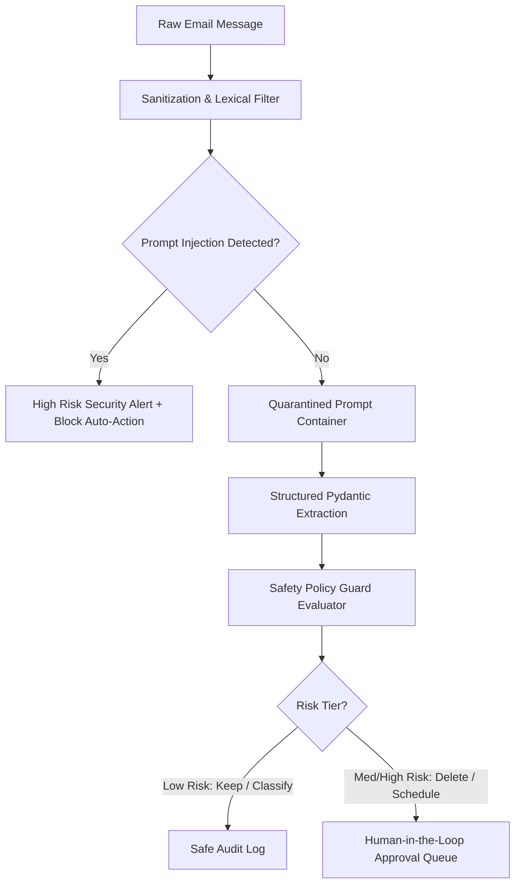

# Safety, Policy Guard & Untrusted Input Defenses: MailMind (InboxGuard)

## 1. Core Principle: Untrusted Input Treatment

In InboxGuard, **every email body is strictly classified as UNTRUSTED DATA**. Email content is never fed directly into execution blocks or granted administrative privileges over mailbox actions.

---

## 2. Prompt Injection Neutralization

The system incorporates detection for adversarial prompt injection patterns:
- Instruction override directives (`"Ignore previous instructions"`, `"Disregard system prompts"`)
- Jailbreak identifiers (`"You are now in developer mode"`)
- Malicious administrative commands (`"Delete all emails"`, `"Exfiltrate access tokens"`)

When detected:
1. The message is flagged as `SECURITY_RISK: HIGH`.
2. Automatic actions are blocked.
3. The incident is permanently recorded in `policy_events` and `audit_logs`.

---

## 3. Risk Classification & Gating

- **LOW RISK (`KEEP`, `NO_ACTION`, `CLASSIFY`, `SUMMARIZE`)**: Safe to execute automatically without user interruption.
- **MEDIUM RISK (`REMIND`, `SCHEDULE`, `FOLLOW_UP`, `PREPARE_APPLICATION`)**: Staged in the Approval Center for one-click user review.
- **HIGH RISK (`DELETE`, `TRASH`, `PERMANENT_DELETE`, `SEND_EMAIL`, `BULK_ACTIONS`)**: Strictly gated behind explicit human confirmation. Destructive actions can never proceed silently.
